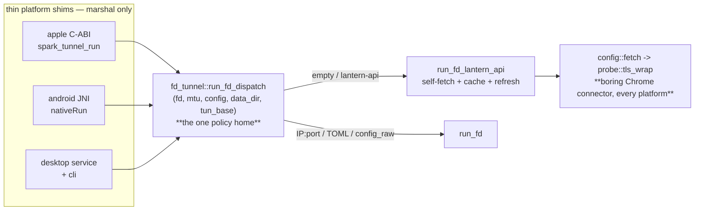

# Cross-platform self-fetch config — design (v1)

> Status: **implemented 2026-06-23** for the fd-shim platforms (iOS, iOS-sim, macOS, Android); the
> desktop service is a documented follow-up (§4/§7). Follow-on to `docs/config-new-fetch-design.md`
> (the fetch itself, shipped in PR #20, **darwin-only**). Goal: make self-fetch run on **every**
> platform (iOS, Android, Linux, Windows, macOS) from **one shared code path**, so a platform shim is a
> thin marshaller and the *policy* (when to fetch, how to parse config, how to fail) lives once in
> `core`.
>
> **Done:** `fd_tunnel::run_fd_dispatch` (the one policy home) + `tun_base` merge; Apple shim rewired to
> it (−104 lines); `config-fetch` on every Apple slice (xcframework + swift build green); Android JNI
> extended (config + dataDir via the `jni` crate) + `config-fetch`/boring baked into the android
> `spark-core` dep + Kotlin caller updated. BoringSSL cross-compiles for `aarch64-apple-ios`,
> `-ios-sim`, and `aarch64-linux-android` (verified). All builds + clippy + the `explicit_config`
> dispatch test green.
>
> **Decided (2026-06-23):** keep BoringSSL/Chrome-mimic TLS for the fetch on **every** platform,
> including iOS — see §3. Rationale: the cold-start bootstrap fetch is the most censorship-sensitive
> moment; presenting the same full Chrome JA4 fingerprint on every platform means a censor can't
> fingerprint "iOS Lantern is fetching its config" differently from macOS. The cost is a BoringSSL
> cross-compile for the iOS/Android targets — paid once in the build scripts, not in the fetch code.

## 1. Why it was darwin-only (the starting point)

> This section describes the state **before this PR**; §2 onward is what the PR changed. Two
> independent reasons held it to darwin: the first a build constraint, the second just missing wiring.

### 1a. The fetch's TLS is BoringSSL-bound, and BoringSSL was only built for the macOS slice

`core::config::fetch` is **100 % portable Rust** — `mod.rs`/`user.rs`/`http.rs`/`request.rs`/`cache.rs`
have zero OS deps. The one byte-level dependency is the HTTPS handshake; both POST sites call
`transport::probe::tls_wrap`:

- `core/src/config/fetch/mod.rs:128` — config-new POST
- `core/src/config/fetch/user.rs:102` — `/user-create` POST

`tls_wrap` is `#[cfg(feature = "anytls")]`-gated to `boring2::ssl::SslConnector` +
`tokio_boring2::connect` (`core/src/transport/probe.rs:254-272`); without `anytls` it's a stub that
errors (`probe.rs:274-282`). Feature chain:

```
config-fetch  →  anytls  →  boring2 + tokio-boring2 + flint-tls/boring   (BoringSSL, a cmake C build)
              →  multi-server  →  flint-dial            (no boring of its own)
```

`core/Cargo.toml:110`: `config-fetch = ["anytls", "multi-server"]`. **Before this PR** the build
scripts only compiled BoringSSL for the **darwin** slice (`build-xcframework.sh` enabled `anytls` for
`*darwin*` only; `platforms/android` enabled only `system-stack`), so `config-fetch` was off for iOS,
Android, and desktop. **We keep this TLS** (decision above) and now build BoringSSL for the other
targets too (§3).

### 1b. Only the Apple shim invoked the self-fetch path

The self-fetch *dispatch* was inline in the Apple C-ABI: null/empty/`"lantern-api"` →
`run_fd_lantern_api`; `IP:port` (IP literal) → relay; else → `Config::from_config_str`.

- **Android**: `nativeRun(fd, mtu, addr, prefix, system_stack)` called `fd_tunnel::run_fd` directly.
  **No config string, no data_dir, no self-fetch.**
- **Desktop service/CLI** (`service/`, `cli/`): no `config-fetch` / `lantern-api` reference; config
  came from a TOML file via the IPC control plane.

So even once BoringSSL built everywhere, three of four shims still wouldn't have *called* the fetch —
hence Part B (§4).

## 2. Goal & shape



Two changes deliver "all platforms use the same code":

- **(A) Build BoringSSL for the iOS + Android targets** and enable `config-fetch` on those slices +
  desktop. The fetch code is unchanged — it stays on `probe::tls_wrap` (boring). No TLS seam, no
  `tokio-rustls`.
- **(B) One shared dispatch** in `fd_tunnel` that every shim calls — the apple decision tree, hoisted.

## 3. Part A — build BoringSSL for every target (keep the Chrome-mimic TLS)

The work is making `boring2`/`boring-sys2` (the bundled BoringSSL + cmake build) cross-compile for the
non-darwin targets, then turning `config-fetch` on for those slices.

**CA trust roots (required for the fetch on mobile).** BoringSSL ships **no** built-in trust store and
its default verify paths only resolve the OS CA store on desktop (macOS/Linux/Windows) — on Android/iOS
they don't, so a direct fetch to a public host fails `CERTIFICATE_VERIFY_FAILED`. **Verified on the
Android emulator** (2026-06-24): the fetch failed cert verification until the fix. So `tls_wrap`
(`core/src/transport/probe.rs`, the connector the fetch + multi-server callback use) loads the Mozilla
root set (`webpki-root-certs`, pulled by `anytls`) into the connector's X509 store — verification then
works identically on every platform (the desktop default paths still apply on top). The fetch's trust
model is "Trust = TLS", so this is load-bearing, not cosmetic.

**Keystone (do first, before any wiring):** prove BoringSSL cross-compiles. If any target can't build
it, that platform's plan changes and we report back before proceeding.

```bash
# iOS device + simulator (Xcode provides the SDK; cc/cmake crates pick up the cross toolchain):
cargo build --release -p spark-apple --target aarch64-apple-ios     --features anytls,config-fetch,multi-server,bootstrap-dns,samizdat,shadowsocks,hysteria2
cargo build --release -p spark-apple --target aarch64-apple-ios-sim --features anytls,config-fetch,multi-server,bootstrap-dns,samizdat,shadowsocks,hysteria2
# Android (cargo-ndk supplies the NDK toolchain cmake targets):
cargo ndk -t arm64-v8a build --release -p spark-android --features anytls,config-fetch,multi-server,bootstrap-dns,samizdat,shadowsocks,hysteria2
```

Likely build knobs if the bundled build needs help: a working `cmake`, `BORING_BSSL_PATH`/sysroot or
`CMAKE_TOOLCHAIN_FILE` for the NDK, and the iOS deployment-target env. BoringSSL itself supports
iOS/Android (it's Google's), so the risk is toolchain plumbing, not portability.

**Binary size:** BoringSSL adds materially to the slice it's on. It already ships in the macOS slice;
this extends that to iOS/Android/desktop `config-fetch` builds. The base (no-`config-fetch`) build is
unaffected and stays cmake-free.

## 4. Part B — one shared dispatch in `fd_tunnel`

Hoist the apple decision tree into `core` so every shim calls the same function:

```rust
// core/src/fd_tunnel.rs
/// The single home of the config-acquisition policy the shims share. `config`: the controlling app's
/// explicit data-path string (None = no app config). `tun_base`: the platform's tun primitives
/// (addr/prefix/stack) — Apple = userspace defaults, Android = its VpnService addr/prefix + system
/// stack. Returns the C-style status (0 clean / -1 error). `fd` ownership is transferred.
pub fn run_fd_dispatch(
    fd: i32,
    mtu: u16,
    config: Option<&str>,
    data_dir: Option<&std::path::Path>,
    tun_base: Config,        // built via fd_config(addr, prefix, system_stack)
) -> i32
```

Logic (lifted verbatim from `platforms/apple/src/lib.rs`, plus the tun-base merge):

1. Trim `config`. `None`/empty/`"lantern-api"`:
   - `#[cfg(feature = "config-fetch")]` → `run_fd_lantern_api(fd, mtu, data_dir, tun_base)` (needs a
     `data_dir`; else `abandon_fd` + `-1`).
   - `#[cfg(not(...))]` → empty falls through to direct (`run_fd` with `tun_base`); explicit
     `"lantern-api"` → `abandon_fd` + `-1` (can't serve it).
2. `IP:port` literal (IP only — `transport.server` is a `SocketAddr`, so hostnames don't apply here) →
   relay override: `tun_base` + `transport.server = addr` → `run_fd`.
3. else → `Config::from_config_str` merged onto `tun_base` → `run_fd`; parse failure → `abandon_fd` + `-1`.

**The netstack merge (new):** `run_fd_lantern_api` currently builds its `Config` purely from the fetched
`config_raw.json`, whose `tun` section is defaults (userspace) — fine for Apple, wrong for Android
(needs `StackKind::System`). So `run_fd_lantern_api` gains a `tun_base: Config` param: the fetched
`transport` (server pool) is merged **onto** the platform's `tun_base`, so the platform owns
`tun.{addr,prefix,stack}` and the fetch owns `transport.servers`. Apple passes
`Config::default()` (the userspace tun base — equivalent to `fd_config(default, default, false)`);
Android passes `fd_config(addr, prefix, system_stack)`.

Each shim shrinks to marshalling:

- **Apple C-ABI** — `spark_tunnel_run` becomes: resolve `cfg_str`/`data_dir` C strings →
  `run_fd_dispatch(fd, mtu, cfg, dir, Config::default())`. The `#[cfg]` blocks move
  into core. (No behavior change on macOS/iOS.)
- **Android JNI** — extend the entry to carry the app's config + data_dir:
  `nativeRun(fd, mtu, addr, prefix, system_stack, config: JString, dataDir: JString)` →
  `run_fd_dispatch(fd, mtu, cfg, dir, fd_config(addr, prefix, system_stack != 0))`. The Kotlin side
  passes `null`/`"lantern-api"` for self-fetch + the app files dir. Passing strings across JNI needs
  JNI env calls, so the shim adds the **`jni` crate** (Android-target-only — zero impact on the Apple /
  desktop / core builds), superseding the former "primitive-only, no jni crate" note now that the shim
  carries a path + config string, not just ints. **Readiness gate:** because self-fetch fetches config
  *before* servicing the fd and a `VpnService`'s routes are live the moment `establish()` returns (no
  completion handler), the shim also exposes `mark_connecting` + `wait_ready(timeout_ms)` over JNI
  (mirroring the Apple NE, design `config-new-fetch-design.md` §6); the `VpnService` marks connecting
  before the worker, waits bounded for the data path, and **stops the VPN on timeout** so a stuck
  cold-start fetch falls back to direct instead of blackholing device traffic.
- **Desktop service** — *deferred to its own milestone* (decided 2026-06-23). The service opens its own
  TUN (`CoreEngine`, not the fd-adopt path) and takes a fully-resolved `Config` per-connect, so it
  shares the lower-level `config::fetch` (`load_or_fetch` + `run_loop`), **not** `run_fd_lantern_api`.
  Integration point: in the connect flow (`service/src/service.rs`), when self-fetch is selected (a
  `--lantern-api` flag or a launch-config sentinel — TBD), call `config::fetch::load_or_fetch(state_dir,
  env)` to obtain the `Config`, spawn `run_loop` for the connection's lifetime, then `engine.start`. The
  shipping self-fetch targets are the fd-shim platforms (iOS/macOS/Android); the desktop daemon has no
  self-fetch today, so this lands as a focused follow-up rather than mid-sweep changes to the privileged
  connect flow + kill-switch/reconnect lifecycle.

## 5. Per-platform build wiring

| Platform | Build change to enable self-fetch |
|---|---|
| **iOS** | cross-build BoringSSL for `aarch64-apple-ios`(+`-sim`); add `config-fetch` (+ the transport features) to the iOS slice in `build-xcframework.sh`. The shim already handles `lantern-api`; the `#[cfg]` flips on. |
| **Android** | cross-build BoringSSL via cargo-ndk; add `config-fetch` (+ transports) to the android `spark-core` features; extend the JNI entry (§4) + Kotlin caller. |
| **Linux / Windows** | enable `config-fetch` on the `service` build; wire the "no TOML → self-fetch" branch (§4). |
| **macOS** | unchanged (already on). |

`bootstrap-dns` (hostname pool members) is enabled alongside `config-fetch` on each slice, as on darwin.

## 6. What stays the same / out of scope

- The fetch code (`config::fetch`), the wire contract, `/user-create`, cache, cadence, readiness gating
  (design doc §2-§7) are **unchanged** — they're already portable and stay on the boring connector.
- **Fronting / censored cold-start** (design §9) remains a deferred milestone; it layers fronted-host
  selection on top of the boring connector the fetch already uses, on every platform now.
- Pro tier, smart-routing/DNS ingestion — still deferred.

## 7. Sequencing

1. **Keystone:** prove BoringSSL cross-compiles for `aarch64-apple-ios`(+`-sim`) and the android target
   (§3). If a target fails, stop and report.
2. **Part B** (shared dispatch + `tun_base` merge) + rewire the Apple shim to it (zero behavior change;
   regression-test the macOS DMG). Enable `config-fetch` on the iOS slice in `build-xcframework.sh`.
3. **Android**: JNI (+`jni` crate) + Kotlin wiring + bake `config-fetch`/transports into the android
   `spark-core` dep; verify the cargo-ndk build.
4. **Desktop service** *(deferred — own milestone)*: shares `config::fetch::load_or_fetch` + `run_loop`
   from the connect flow; trigger design (flag vs sentinel) + kill-switch/reconnect interaction TBD.

## 8. Decision record

**Fetch TLS backend: BoringSSL/Chrome-mimic on every platform, including iOS (decided 2026-06-23).**
Considered: (a) rustls-default + boring-when-anytls, (b) rustls-everywhere, (c) **boring-everywhere
(chosen)**. (a)/(b) build smaller and avoid the iOS BoringSSL cross-compile, but make the iOS cold-start
fetch present a distinguishable vanilla-rustls fingerprint while macOS presents Chrome — a censor-visible
inconsistency at the most sensitive moment. (c) keeps the fingerprint uniform; the cost is the
cross-compile, paid once in the build scripts. An ADR may formalize this.

## 9. References

- `docs/config-new-fetch-design.md` — the fetch itself (v1, shipped PR #20).
- `core/src/config/fetch/{mod,user,http,request,cache}.rs`; `core/src/transport/probe.rs:254-282`
  (the boring TLS connector); `core/src/fd_tunnel.rs:164-364` (`fd_config`/`run_fd`/`run_fd_lantern_api`).
- `platforms/apple/src/lib.rs:54-130` (the dispatch to hoist); `platforms/android/src/lib.rs:37-55`.
- `core/Cargo.toml:75-118` (feature graph); `platforms/apple/build-xcframework.sh` (slice features).
