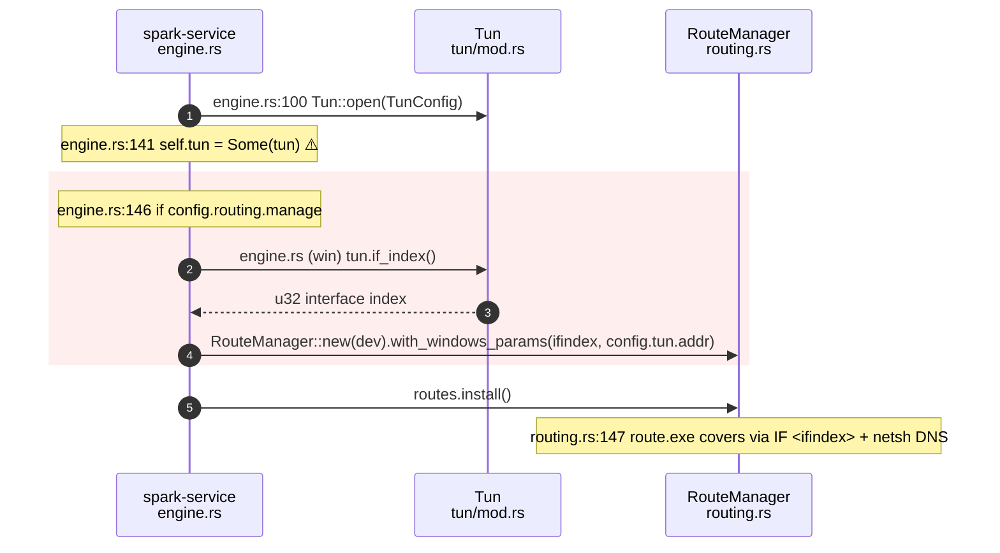

# Windows W2a — Core Tunnel Wiring Implementation Plan

> **For agentic workers:** REQUIRED SUB-SKILL: Use superpowers:subagent-driven-development (recommended) or superpowers:executing-plans to implement this plan task-by-task. Steps use checkbox (`- [ ]`) syntax for tracking.

**Goal:** Make the merged W1 Windows `RouteManager` actually install when the privileged `spark-service` brings the tunnel up, by exposing the open TUN's interface index and threading it (plus the tunnel DNS resolver) into `RouteManager::with_windows_params`.

**Architecture:** Two small, cfg-gated changes in the data path. (1) `core/src/tun/mod.rs` gains a `Tun::if_index()` pass-through to tun-rs's `DeviceImpl::if_index()` (available on unix and Windows; `AsyncDevice` re-exposes it via `Deref`). (2) `service/src/engine.rs`'s `CoreEngine::start` constructs the `RouteManager` with the Windows params on Windows and unchanged elsewhere. No new dependencies; no data-path behavior change on macOS/Linux.

**Tech Stack:** Rust (edition 2021, MSRV 1.85), `tun-rs` 2.8.5, `tokio`. Cross-compile gate via `cargo xwin` for `x86_64-pc-windows-msvc`.

---

## Context for the implementer (read before starting)

- **W1 is merged** (PR #59). `core/src/routing.rs` already has the Windows `RouteManager`:
  - `RouteManager::new(tun: impl Into<String>)` — sets `windows: None` on Windows.
  - `#[cfg(target_os = "windows")] pub fn with_windows_params(self, ifindex: u32, resolver: std::net::Ipv4Addr) -> Self` — **mandatory** on Windows; `install()`/`restore()` return `io::Error(Unsupported)` if it was never called (verified by the existing `windows_params_are_mandatory_and_fail_fast` test).
  - The existing routing unit tests already prove the ifindex reaches the emitted `route.exe` argv, so W2a does **not** need to re-test route emission — only that the engine *supplies* the params.
- **`CoreEngine` is the real engine**, not a stub. `start()` (`service/src/engine.rs:88`) opens the TUN, starts the netstack + proxy supervisor, then — only when `config.routing.manage` is true — builds a `RouteManager` and calls `install()`.
- **The bug being fixed:** today `CoreEngine::start` calls `RouteManager::new(&device)` on *all* platforms. On Windows that manager has no params, so `install()` fails fast with `Unsupported` and the tunnel comes up with no routes. W2a supplies the params on Windows.
- **`tun-rs` API (verified against `tun-rs-2.8.5` source):**
  - `DeviceImpl::if_index(&self) -> io::Result<u32>` exists on both `src/platform/unix/device.rs:159` and `src/platform/windows/device.rs:265`.
  - `AsyncDevice` (both the unix and windows variants) `Deref`s to `DeviceImpl`, so `self.dev.if_index()` resolves on the `AsyncDevice` our `Tun` holds — the same way `self.dev.name()` and `self.dev.mtu()` already do.
  - Not available on android/ios (from-fd devices; the OS owns the interface) — so gate the accessor `#[cfg(not(any(target_os = "android", target_os = "ios")))]`, mirroring `Tun::name()`.
- **`config.tun.addr` is `std::net::Ipv4Addr`** (it is already passed as `TunConfig.ipv4.0` at `engine.rs:102`). It is the tun's own IP, where spark's fake-IP DNS responder listens — exactly the `resolver` `with_windows_params` wants.
- **Why no bespoke unit tests here:** both changes are privileged FFI wiring — `Tun::if_index()` needs an open device (root), and `CoreEngine::start` opens a real TUN, so neither is host-unit-testable. This matches the rest of `tun/mod.rs` (zero unit tests) and W1's approach (pure logic unit-tested in `routing.rs`; the privileged executor cross-compiled + deferred). Verification for W2a is: host clippy + `cargo xwin` cross-clippy (compiles the Windows branch) + the existing whole-workspace test suite stays green. **Do not write fake tests that don't exercise real behavior** (test-driven-development skill: mocks-only tests that assert the mock are an anti-pattern). Flag the deferral honestly in the PR.
- **CLAUDE.md constraints in force:** no `unwrap()`/`expect()` outside tests/one-shot startup; propagate every `Result`; `cargo fmt` before commit; `cargo clippy -- -D warnings` clean. Do not add dependencies. Do not `git add -A`/`.` (untracked `gui-tauri/src-tauri/target` must never be staged) — stage the two changed files explicitly.

---

## File Structure

- **Modify** `core/src/tun/mod.rs` — add `Tun::if_index()` (cfg `not(any(android, ios))`).
- **Modify** `service/src/engine.rs` — cfg-gate the `RouteManager` construction in `CoreEngine::start`.

No files created. No test files (see "Why no bespoke unit tests" above).

---

## Task 1: `Tun::if_index()` accessor

**Files:**
- Modify: `core/src/tun/mod.rs` (add a method after `Tun::name()`, ~line 97)

- [ ] **Step 1: Add the accessor**

Insert directly after the `name()` method (which ends at ~line 97), inside `impl Tun`:

```rust
    /// The OS interface index of the device. Windows `route.exe`/`netsh` address the adapter by
    /// numeric index (not name), so the engine threads this into
    /// [`RouteManager::with_windows_params`](spark_core_routing_link). Available on every desktop
    /// platform; not on Android/iOS (a from-fd device's interface is owned by the OS).
    #[cfg(not(any(target_os = "android", target_os = "ios")))]
    pub fn if_index(&self) -> Result<u32, TunError> {
        self.dev.if_index().map_err(TunError::Query)
    }
```

Note: replace the `spark_core_routing_link` placeholder in the doc comment with a plain-text
reference — rustdoc cannot resolve a cross-crate intra-doc link from `core` to a symbol the same
crate exposes. Use the literal text `` `RouteManager::with_windows_params` `` (backticked, no link),
so `cargo doc` does not warn. Final doc line:

```rust
    /// so the engine threads this into `RouteManager::with_windows_params`. Available on every
    /// desktop platform; not on Android/iOS (a from-fd device's interface is owned by the OS).
```

- [ ] **Step 2: Verify it compiles on the host**

Run: `cargo build -p spark-core`
Expected: builds clean (the method is compiled into the macOS build because macOS is not android/ios).

- [ ] **Step 3: Verify it cross-compiles for Windows**

Run: `cargo xwin clippy -p spark-core --all-targets --target x86_64-pc-windows-msvc -- -D warnings`
Expected: clean. (This compiles the Windows path of `if_index`, where `self.dev` is the Windows `AsyncDevice` that `Deref`s to the Windows `DeviceImpl::if_index`.)

If `cargo xwin` is not found, install once: `cargo install cargo-xwin` and ensure `brew install llvm` has run (bare `cargo clippy --target x86_64-pc-windows-msvc` fails — `ring`'s C build needs the Windows SDK that cargo-xwin + llvm supply).

- [ ] **Step 4: Commit**

```bash
git add core/src/tun/mod.rs
git commit -m "$(cat <<'EOF'
Windows W2a: expose Tun::if_index() for route.exe interface addressing

Co-Authored-By: Claude Opus 4.8 <noreply@anthropic.com>
EOF
)"
```

---

## Task 2: Thread the Windows params into `CoreEngine::start`

**Files:**
- Modify: `service/src/engine.rs:146-154` (the `if config.routing.manage { ... }` block)

- [ ] **Step 1: Replace the RouteManager construction with a cfg-gated version**

The current block (`engine.rs:146-154`) is:

```rust
        if config.routing.manage {
            let mut routes = RouteManager::new(&device);
            let outcome = routes.install().await;
            self.routes = Some(routes);
            if let Err(e) = outcome {
                let _ = self.stop(Teardown::RestoreDirect).await;
                return Err(EngineError(format!("installing routes: {e}")));
            }
        }
```

Replace it with:

```rust
        if config.routing.manage {
            let mut routes = RouteManager::new(&device);
            // Windows `route.exe`/`netsh` address the adapter by numeric interface index, and spark
            // points the adapter's DNS at the tun's own fake-IP resolver (its IPv4 address). W1's
            // Windows RouteManager makes these params mandatory (install() fails fast otherwise), so
            // supply them from the open device here. No-op on macOS/Linux (name-addressed routes).
            #[cfg(target_os = "windows")]
            {
                let ifindex = match self.tun.as_ref() {
                    Some(tun) => tun
                        .if_index()
                        .map_err(|e| EngineError(format!("querying TUN interface index: {e}")))?,
                    None => return Err(EngineError("TUN missing while installing routes".into())),
                };
                routes = routes.with_windows_params(ifindex, config.tun.addr);
            }
            let outcome = routes.install().await;
            self.routes = Some(routes);
            if let Err(e) = outcome {
                let _ = self.stop(Teardown::RestoreDirect).await;
                return Err(EngineError(format!("installing routes: {e}")));
            }
        }
```

Why read from `self.tun` rather than the local `tun`: `self.tun = Some(tun)` at `engine.rs:141`
moves the local `tun` into `self` before this block, so the local is gone. `self.tun.as_ref()` is a
short immutable borrow that ends when `if_index()` returns a `u32` (Copy), before any `self.stop()`
mutable borrow — no borrow conflict. The `None` arm cannot actually be hit (self.tun was just set)
but is handled without `expect()` to satisfy CLAUDE.md's no-`expect` rule.

Do **not** wrap `routes` in `let mut` differently or touch the non-Windows path — `let mut routes`
is already present and is still needed on Windows (the `routes = routes.with_windows_params(...)`
reassignment). On non-Windows, `mut` is used by nothing new, but it was already `mut` in the
original (it isn't — see next step).

- [ ] **Step 2: Confirm `let mut routes` does not trip an unused-mut warning on non-Windows**

The original line is `let mut routes = RouteManager::new(&device);`. `routes` is later used by
`routes.install()` (a `&mut self` method — confirm: `install(&mut self)` in routing.rs), so `mut` is
required on all platforms and there is no `unused_mut`. If clippy flags `unused_mut` on any platform,
STOP and re-check whether `install` takes `&mut self` (it does per routing.rs:139/147) before
changing anything.

- [ ] **Step 3: Verify the host build + clippy**

Run: `cargo clippy -p spark-service --all-targets -- -D warnings`
Expected: clean. (On macOS the `#[cfg(target_os = "windows")]` block is compiled out, so the engine
is byte-for-byte unchanged in behavior.)

- [ ] **Step 4: Verify the Windows cross-compile**

Run: `cargo xwin clippy -p spark-service --all-targets --target x86_64-pc-windows-msvc -- -D warnings`
Expected: clean — this is the only build that compiles the new `#[cfg(target_os = "windows")]` block,
so it is the real check that `Tun::if_index()`, `with_windows_params`, and `config.tun.addr` line up.

- [ ] **Step 5: Commit**

```bash
git add service/src/engine.rs
git commit -m "$(cat <<'EOF'
Windows W2a: thread if_index + tun resolver into the service RouteManager

On Windows, CoreEngine::start now supplies the open device's interface index
and the tunnel DNS resolver (the tun's IPv4) to RouteManager, which W1 made
mandatory. Without this the Windows service brought the tunnel up with no
routes (install() fail-fast). No-op on macOS/Linux. FFI wiring, verified by
host + cargo-xwin cross-clippy; on-Windows install deferred to hardware.

Co-Authored-By: Claude Opus 4.8 <noreply@anthropic.com>
EOF
)"
```

---

## Task 3: Full gate + PR

**Files:** none (verification + PR).

- [ ] **Step 1: Format check**

Run: `cargo fmt --all --check`
Expected: no diff. (If it fails, run `cargo fmt --all`, re-stage the two files, and amend the
relevant commit — a `cargo fmt` diff surfaces as a *fast-failing* `test` CI job.)

- [ ] **Step 2: Host clippy across the whole workspace**

Run: `cargo clippy --workspace --all-targets -- -D warnings`
Expected: clean.

- [ ] **Step 3: Windows cross-clippy across the whole workspace**

Run: `cargo xwin clippy --workspace --all-targets --target x86_64-pc-windows-msvc -- -D warnings`
Expected: clean.

- [ ] **Step 4: Whole-workspace tests (host)**

Run: `cargo test --workspace`
Expected: all green. This runs the pure + non-windows-cfg tests (including the existing routing unit
tests that prove ifindex → argv); the `cfg(windows)` routing/engine tests run only in the
`windows-latest` CI job.

- [ ] **Step 5: Push the branch and open the PR**

```bash
git push -u origin fisk/windows-w2-service
```

Then open the PR (title ends with the squash-style number placeholder; fill NN after creation is not
possible — GitHub assigns it, so title it and let the squash carry it):

```bash
gh pr create --repo getlantern/spark --base main --head fisk/windows-w2-service \
  --title "Windows W2a: core tunnel wiring (Tun::if_index + service RouteManager params)" \
  --body "$(cat <<'EOF'
## Summary

W2a of Windows support (W2 = live `spark-service`, split into W2a core wiring / W2b loop-prevention /
W2c transport for tractable review). This is the small, dependency-free piece that makes the merged
W1 Windows `RouteManager` (#59) actually install when the privileged service brings the tunnel up.

- `core/src/tun/mod.rs`: add `Tun::if_index()` — a pass-through to tun-rs `DeviceImpl::if_index()`
  (unix + Windows; `AsyncDevice` re-exposes it via `Deref`). Gated `not(any(android, ios))`, mirroring
  `Tun::name()`.
- `service/src/engine.rs`: on Windows, `CoreEngine::start` now builds the `RouteManager` with
  `with_windows_params(tun.if_index()?, config.tun.addr)`. W1 made those params **mandatory**
  (`install`/`restore` fail fast without them), so before this change the Windows service came up with
  no routes. No-op on macOS/Linux.

## Call flow



## Test plan

- `cargo fmt --all --check` — clean
- `cargo clippy --workspace --all-targets -- -D warnings` — clean (macOS host)
- `cargo xwin clippy --workspace --all-targets --target x86_64-pc-windows-msvc -- -D warnings` — clean
  (this is the only build that compiles the new `#[cfg(target_os = "windows")]` engine branch)
- `cargo test --workspace` — green; existing `routing.rs` tests already prove the ifindex reaches the
  emitted `route.exe` argv, so the wiring is covered end-to-end at the unit level.

## Not validated (deferred to hardware)

Built on a **macOS host**. Both changes are privileged FFI wiring (`if_index` needs an open device;
`CoreEngine::start` opens a real WinTun adapter), so on-Windows behavior — the actual `route.exe`
install with the real interface index — is **not** validated here. That is captured in the W4
on-device checklist. cfg(windows) tests run in the `windows-latest` CI job.

🤖 Generated with [Claude Code](https://claude.com/claude-code)
EOF
)"
```

- [ ] **Step 6: Run the review-pr loop**

Per the goal prompt: request Copilot + ensure CodeRabbit; verify each comment before acting; fix or
push back with rationale; reply then resolve threads; re-request; loop until a clean round or ~4
rounds; merge (`gh pr merge --squash`) when review converged AND all CI green (incl. windows-latest)
AND 0 unresolved threads. Then proceed to W2b.

---

## Self-Review (completed during planning)

- **Spec coverage:** W2a covers the "install W1 routes" prerequisite of the spec's W2 "real
  TunnelEngine Windows path". The remaining W2 items (loop-prevention, pipe/winsvc/auth transport)
  are explicitly W2b/W2c per the updated spec §W2 — not dropped.
- **Placeholder scan:** the only placeholder is the rustdoc-link caveat in Task 1, which is resolved
  in-step (use backticked plain text, not an intra-doc link).
- **Type consistency:** `if_index()` returns `Result<u32, TunError>`; the engine maps its error to
  `EngineError` and passes the `u32` to `with_windows_params(ifindex: u32, resolver: Ipv4Addr)` with
  `config.tun.addr: Ipv4Addr`. `install(&mut self)` matches the `let mut routes` binding. Verified
  against routing.rs (`with_windows_params` signature) and engine.rs (`config.tun.addr` usage).
